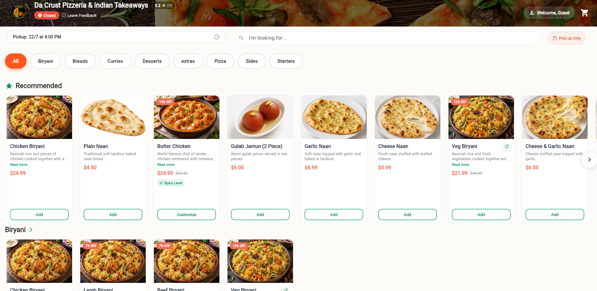
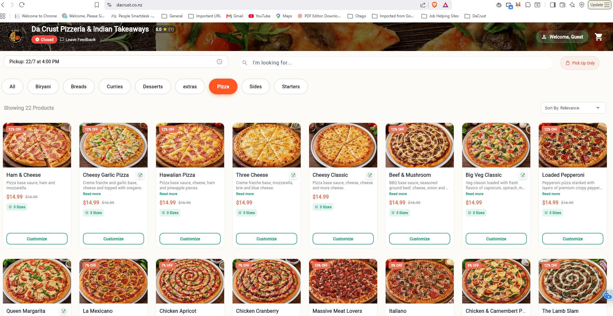
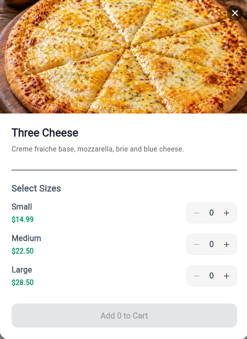
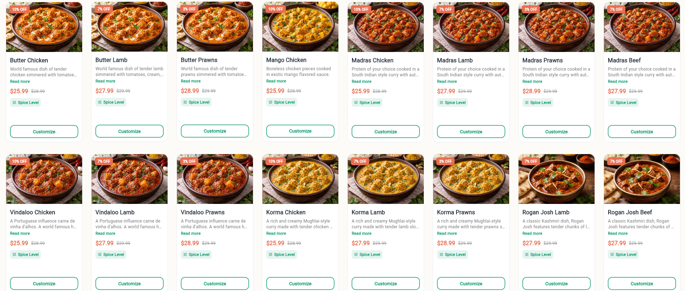
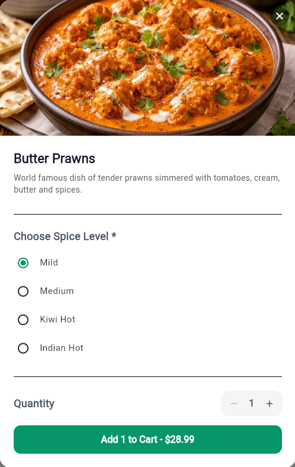
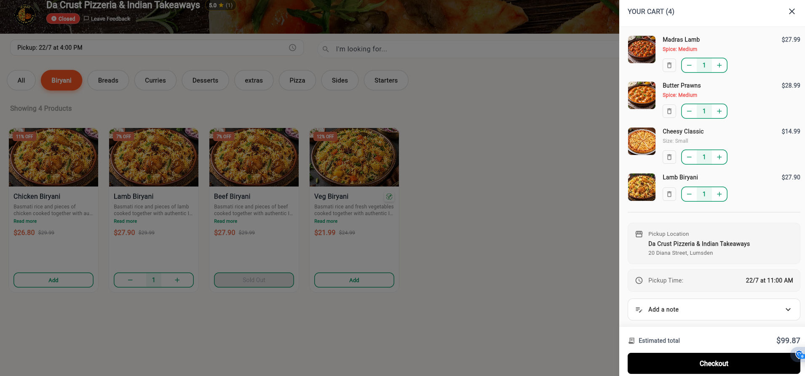
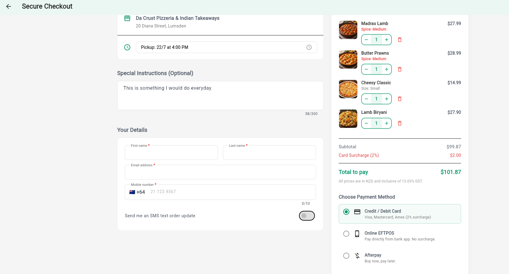
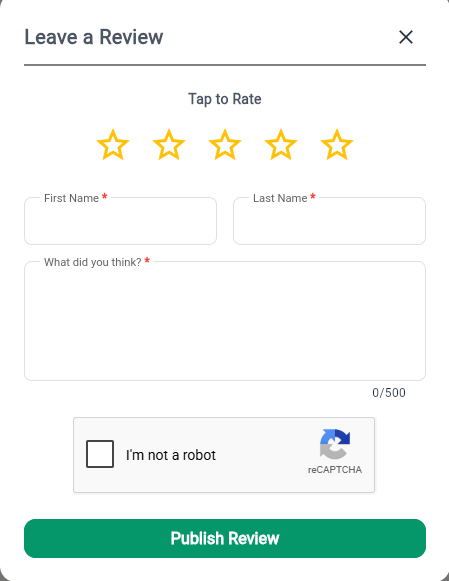

# Da Crust Online Ordering Platform

**Live App:** [https://dacrust.co.nz](https://dacrust.co.nz)

A modern, fully-featured online ordering web application built for **Da Crust Pizzeria & Indian Takeaways** — a popular restaurant in Lumsden, New Zealand offering authentic Indian cuisine and freshly baked pizzas.

The platform enables customers to browse the full menu, customize items, place pickup orders, and complete secure payments — all from a clean, mobile-friendly interface.

---

## 🍕 About the Restaurant

**Da Crust Pizzeria & Indian Takeaways**  
📍 20 Diana Street, Lumsden 9730, New Zealand

Specialising in:
- Handcrafted pizzas (multiple sizes)
- Authentic Indian curries, biryanis, breads & starters
- Desserts and sides

The restaurant operates as **Pickup Only**.

---

## ✨ Key Features

### Menu & Ordering Experience
- Categorised menu (All, Biryani, Breads, Curries, Desserts, Extras, Pizza, Sides, Starters)
- Recommended items section
- Product search
- High-quality food photography
- Discount badges and pricing (including GST)

### Product Customisation
- **Pizzas**: Select size (Small / Medium / Large)
- **Curries & Indian dishes**: Choose spice level (Mild, Medium, Kiwi Hot, Indian Hot)
- Quantity adjustment
- Special instructions / notes

### Shopping Cart
- Live cart sidebar
- Edit quantities or remove items
- Pickup location & time selection
- Order notes
- Real-time total calculation

### Secure Checkout
- Customer details collection (First name, Last name, Email, Mobile)
- Optional special instructions
- Pickup time confirmation

### Payment Options
Customers can pay using any of the following methods:

| Payment Method          | Details                                      | Surcharge |
|-------------------------|----------------------------------------------|-----------|
| **Credit / Debit Card** | Visa, Mastercard, Amex                       | 2%        |
| **Online EFTPOS**       | Pay directly from bank app                   | None      |
| **Afterpay**            | Buy now, pay later                           | None      |

All prices are in NZD and inclusive of 13.03% GST.

### Order Notifications
After a successful order:
- **Email confirmation** is sent to the email address provided during checkout
- **SMS text order updates** can be enabled via a toggle on the checkout page (“Send me an SMS text order update”)

This ensures customers receive timely updates about their order status.

### Additional Features
- Leave a Review / Feedback system (with star rating and reCAPTCHA)
- Closed / Open status indicator
- Guest checkout (no account required)
- Responsive design optimised for mobile and desktop

---

## 📸 Screenshots

### Homepage & Recommended Items

### Pizza Category

### Product Size Selection (Pizza)

### Curries Category

### Spice Level Customisation

### Shopping Cart

### Secure Checkout (Customer Details + Payment Methods)

> The checkout screen collects the customer’s email address (required) and offers an optional SMS notification toggle.  
> Supported payment methods are clearly displayed: Credit/Debit Card, Online EFTPOS, and Afterpay.

### Leave a Review

---

## 🛠️ Tech Stack

- **Frontend**: Flutter (Web)
- **Backend / Database**: Firebase
- **Payments**: Integrated payment gateway supporting cards, EFTPOS & Afterpay
- **Notifications**: Email + SMS (via integrated providers)

---

## 🚀 Live Demo

👉 **[https://dacrust.co.nz](https://dacrust.co.nz)**

---

## 📝 Notes

- The application is currently configured for **pickup orders only**.
- Card payments attract a 2% surcharge (clearly shown at checkout).
- Online EFTPOS has **no surcharge**.
- Customers receive order confirmations via the email address entered at checkout, with optional SMS updates.

---

  Built with ❤️ for Da Crust Pizzeria & Indian Takeaways, Lumsden

